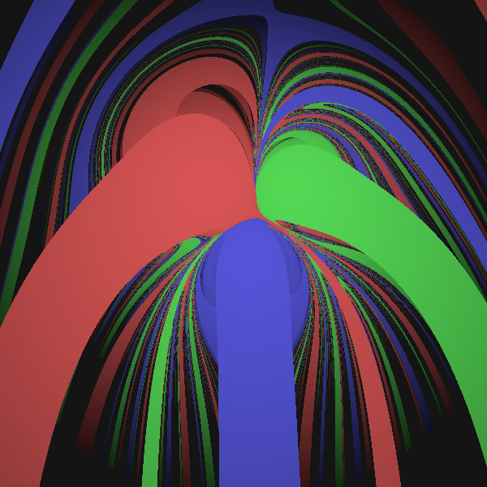

# Gravity Wells Visualization

A Rust application that creates beautiful visualizations of gravitational fields. Each pixel represents where a test particle would end up if dropped at that location.




## What it does

The app simulates thousands of particles starting from different positions. Each particle follows realistic gravity until it either hits a massive body or times out. The resulting image shows:

- **Colored regions**: Areas where particles end up hitting each gravitational body
- **Brighter colors**: Particles that hit quickly  
- **Darker colors**: Particles that take longer to hit
- **Black areas**: Particles that never hit anything

Click anywhere to watch a live simulation of that particle's path.

## Controls

- **Arrow keys**: Change initial velocity
- **WASD**: Move camera
- **Q/E**: Zoom out/in  
- **+/-**: Adjust step size
- **Space**: Switch between Euler and Runge-Kutta integration
- **Enter**: Regenerate image
- **Click**: Run live simulation

## Configuration

Edit `src/config.rs` to change:
- Where the massive bodies are located
- How massive they are
- What colors they use

## Build and Run

```bash
cargo run --release
```

The window is square and shows the current settings on screen. Change parameters and press Enter to see how they affect the gravitational dynamics.
